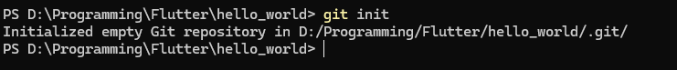
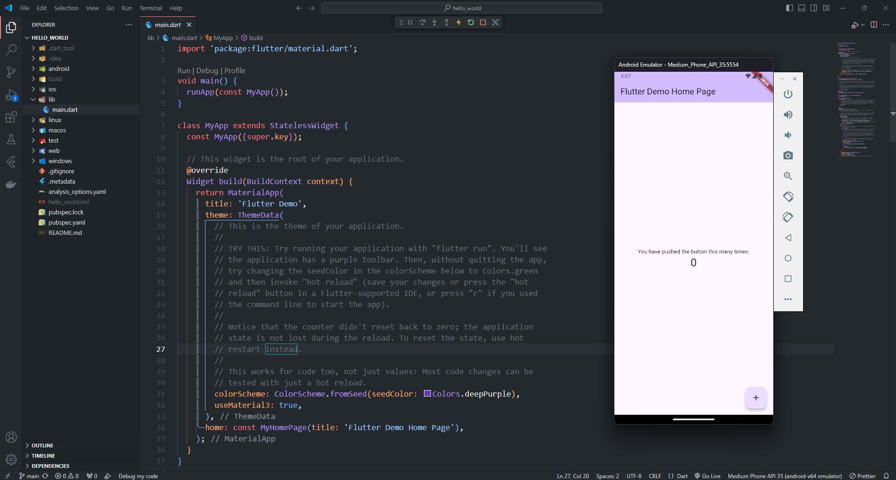
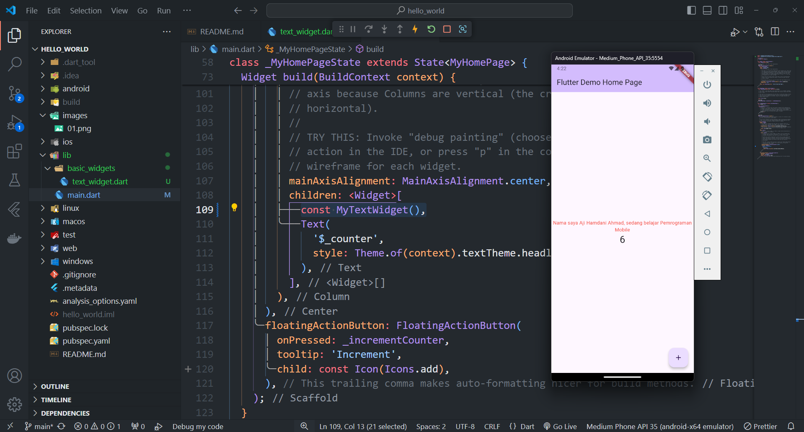

## Praktikum Pemrograman Mobile

> Nama : Aji Hamdani Ahmad <br />
> NIM: 2241720155 <br />
> Kelas : TI-3G <br />
> Absen : 04 <br />

### Praktikum 1: Membuat Project Flutter Baru

- Langkah 1: Memulai instalasi flutter dengan menekan `Ctrl + Shift + P` dan memilih New Application Project dari ekstensi Flutter.
  

  Pada langkah ini akan memulai untuk membuat project baru flutter memanfaatkan ekstensi yang sebelumnya telah didownload yaitu Flutter Extensions.

- Langkah 2: Menentukan root directory untuk menyimpan project flutter yang akan dibuat
  

  Selanjutnya menentukan root directory yang akan digunakan sebagai tempat project flutter dibuat dan disimpan.

- Langkah 3: Membuat nama project flutter `hello_world`, Kemudian menunggu hingga proses installasi project berhasil
  

  Langkah selanjutnya yaitu memasukkan nama project flutter dimana memiliki aturan yaitu menggunakan gaya penulisan snake_case

- Langkah 4: Memastikan project Flutter telah siap
  

  Ketika project flutter telah siap untuk dimulai dalam proses develop, akan terdapat alert dari VSCode yang menunjukkan bahwa project flutter siap untuk dijalankan.

### Praktikum 2: Menghubungkan Perangkat Android atau Emulator

Mengikuti instruksi dari [Basic Android Kotlin Compose Connect Device](https://developer.android.com/codelabs/basic-android-kotlin-compose-connect-device)

- Langkah 1: Mengaktifkan proses debug USB
  

  <!-- Penjelasan -->

  Untuk mengaktifkan developer mode perlu untuk menekan build version dari device Android yang digunakan sebanyak beberapa kali, kemudian akan menampilkan alert bahwa developer mode telah aktif.

- Langkah 2: Mengaktifkan USB debugging
  

  <!-- Penjelasan -->

  Setelah mengaktifkan developer mode, dapat langsung menuju ke developer mode pada device yang digunakan, Kemudian mengaktifkan USB debugging untuk dapat melakukan debugging aplikasi flutter pada device Android yang dimiliki.

- Langkah 3: Menginstall USB driver pada Android Studio
  

- Langkah 4: Menjalankan aplikasi di perangkat Android menggunakan kabel

  <!-- Penjelasan -->

  Sebelumnya menjalankan aplikasi, perlu untuk menghubungkan perangkat Android menggunakan kabel pada Komputer.

  

  Setelah berhasil terhubung langkah selanjutnya yaitu menjalankan aplikasi ke perangkat Android
  

  Setelah itu akan secara otomatis melakukan installasi dan menjalankan aplikasi flutter
  

### Praktikum 3: Membuat Repository Github dan Laporan Praktikum

- Langkah 1: Login ke akun Github, lalu buat repository dengan nama `flutter-fundamental-part1`

  

- Langkah 2: Click tombol `Create repository` lalu akan diarahkan ke halaman repository sebagai berikut

  

- Langkah 3: Buka terminal kemudian ketikkan perintah

  ```bash
  git init
  ```

  **Hasil:**

  

  <!-- Penjelasan -->

  Setelah melakukan git init, kita baru bisa menjalankan perintah git seperti add file, commit file dan juga push file ke repository yang kita miliki

- Langkah 4: Pilih menu Source Control di bagian kiri, lalu lakukan `stages (+)` pada file `.gitignore` untuk mengunggah file pertama ke repository GitHub.

  

- Langkah 5: Beri pesan commit "tambah gitignore" lalu klik Commit (✔)

  

- Langkah 6: Lakukan push dengan klik bagian menu titik tiga > Push
  

- Langkah 7: Di pojok kanan bawah akan tampil seperti gambar berikut. Klik "Add Remote"
  

- Langkah 8: Salin tautan repository Anda dari browser ke bagian ini, lalu klik **Add remote**
  

  Setelah berhasil, tulis remote name dengan "origin"
  

- Langkah 9: Lakukan hal yang sama pada file README.md mulai dari Langkah 4. Setelah berhasil melakukan push, masukkan username GitHub Anda dan password berupa token yang telah dibuat (pengganti password konvensional ketika Anda login di browser GitHub). Reload halaman repository GitHub Anda, maka akan tampil hasil push kedua file tersebut seperti gambar berikut.

  1. Menambahkan file `README.md` menjadi stages file

     

  2. Melakukan commit perubahan yang telah dilakukan

     

  3. Push commit yang telah dilakukan sehingga perubahan akan terlihat seperti berikut pada platform github
     

- Langkah 10: Lakukan push juga untuk semua file lainnya dengan pilih Stage All Changes. Beri pesan commit "project hello_world".
  

- Langkah 11: Kembali ke VS Code, ubah platform di pojok kanan bawah ke emulator atau device atau bisa juga menggunakan browser Chrome. Lalu coba running project hello_world dengan tekan F5 atau Run > Start Debugging. Tunggu proses kompilasi hingga selesai, maka aplikasi flutter pertama Anda akan tampil seperti berikut.
  

- Langkah 12: Silakan screenshot seperti pada Langkah 11, namun teks yang ditampilkan dalam aplikasi berupa nama lengkap Anda. Simpan file screenshot dengan nama 01.png pada folder images (buat folder baru jika belum ada) di project hello_world Anda. Lalu ubah isi README.md seperti berikut, sehingga tampil hasil screenshot pada file README.md. Kemudian push ke repository Anda.
  

  **Hasil Aplikasi**
  

### Praktikum 4: Menerapkan Dasar Widget

- Langkah 1: Text Widget
  Buat folder baru basic_widgets di dalam folder lib. Kemudian buat file baru di dalam basic_widgets dengan nama `text_widget.dart`. Ketik atau salin kode program berikut ke project hello_world Anda pada file `text_widget.dart`.

  

  <!-- Penjelasan -->

  `MyTextWidget` merupakan stateless widget yang akan melakukan build widget Text ketika dijalankan.

  Lakukan import file text_widget.dart ke main.dart, lalu ganti bagian text widget dengan kode di atas. Maka hasilnya seperti gambar berikut. Screenshot hasil milik Anda, lalu dibuat laporan pada file README.md.

  

  <!-- Penjelasan -->

  Untuk menggunakan widget yang telah dibuat dapat menambahkan const dan melakukan instansiasi widget.

  ```dart
  const MyTextWidget()
  ```

  Penggunaan const disarankan ketika tidak ada dependency pada widget tersebut

- Langkah 2: Image Widget

  Buat sebuah file `image_widget.dart` di dalam folder basic_widgets dengan isi kode berikut.

  

  <!-- Penjelasan -->

  Untuk membuat image widget dapat menggunakan widget Image dari flutter dan memberikan argument untuk parameter image berupa AssetImage yang berisi path image yang akan ditampilkan.

  Lakukan penyesuaian asset pada file `pubspec.yaml` dan tambahkan file logo Anda di folder assets project hello_world.

  

  <!-- Penjelasan -->

  Sebelum image dapat ditampilkan harus ditambahkan pada file pubspec.yaml, karena ketika belum ditambahkan maka image tidak akan dapat ditampilkan.

  Jangan lupa sesuaikan kode dan import di file main.dart kemudian akan tampil gambar seperti berikut.

  

  <!-- Penjelasan -->

  Untuk menggunakan image widget dapat dilakukan seperti menggunakan text widget sebelumnya, dimana hasilnya akan menampilkan image yang telah dimasukkan pada path widget Image sebelumnya.

### Praktikum 5: Menerapkan Widget Material Design dan IOS Cupertino

- Langkah 1: Cupertino Button dan Loading Bar

  Buat file di `basic_widgets` > `loading_cupertino.dart`. Import stateless widget dari material dan cupertino. Lalu isi kode di dalam method Widget build adalah sebagai berikut.

  

  <!-- Penjelasan -->

- Langkah 2: Floating Action Button

  Button widget terdapat beberapa macam pada flutter yaitu ButtonBar, DropdownButton, TextButton, FloatingActionButton, IconButton, OutlineButton, PopupMenuButton, dan ElevatedButton.

  Buat file di `basic_widgets` > `fab_widget.dart`. Import stateless widget dari material. Lalu isi kode di dalam method Widget build adalah sebagai berikut.

  

- Langkah 3: Scaffold Widget

  Scaffold widget digunakan untuk mengatur tata letak sesuai dengan material design.

  Ubah isi kode `main.dart` seperti berikut.

  

- Langkah 4: Dialog Widget

  Dialog widget pada flutter memiliki dua jenis dialog yaitu `AlertDialog` dan `SimpleDialog`.

  Ubah isi kode `main.dart` seperti berikut.

  

- Langkah 5: Input dan Selection Widget

  Flutter menyediakan widget yang dapat menerima input dari pengguna aplikasi yaitu antara lain Checkbox, Date and Time Pickers, Radio Button, Slider, Switch, TextField.

  Contoh penggunaan TextField widget adalah sebagai berikut:

  

- Langkah 6: Date and Time Pickers

  Date and Time Pickers termasuk pada kategori input dan selection widget, berikut adalah contoh penggunaan Date and Time Pickers.

  

### Selesaikan [Codelabs: Your first Flutter app](https://codelabs.developers.google.com/codelabs/flutter-codelab-first#0), lalu buatlah laporan praktikumnya dan push ke repository GitHub Anda!

- ### Membuat project baru dan memulai starter app

  

- ### Menambahkan sebuah button

  Untuk menambahkan button dapat menggunakan `ElevatedButton`

  ```dart
  Widget build(BuildContext context) {
    var appState = context.watch<MyAppState>();

    return Scaffold(
      body: Column(
        children: [
          Text('A random idea:'),
          BigCard(pair: pair),

          // Add Button
          ElevatedButton(
              onPressed: () {
                print('button pressed!')
              },
              child: Text('Next'))
        ],
      ),
    );
  }
  ```

  Dengan kode tersebut maka akan menghasilkan output sebagai berikut

  

  Pada button juga dapat ditambahkan sebuah action ketika button mendapatkan event seperti onPressed, Dapat menambahkan fungsi seperti berikut

  ```dart
  Widget build(BuildContext context) {
    var appState = context.watch<MyAppState>();
    var pair = appState.current;

    return Scaffold(
      body: Column(
        children: [
          Text('A random AWESOME idea:'),
          Text(pair.asLowerCase),

          // Add Button
          ElevatedButton(
              onPressed: () {
                appState.getNext();
              },
              child: Text('Next'))
        ],
      ),
    );
  }
  ```

  Kemudian juga dapat membuat class baru sebagai extra widget seperti `BigCard`

  ```dart
  class BigCard extends StatelessWidget {
    const BigCard({
      super.key,
      required this.pair,
    });

    final WordPair pair;

    @override
    Widget build(BuildContext context) {
      return Text(pair.asLowerCase);
    }
  }
  ```

  Kemudian mengganti penggunaan `Text` pada MyHomePage menjadi `BigCard`

  ```dart
  Widget build(BuildContext context) {
    var appState = context.watch<MyAppState>();
    var pair = appState.current;

    return Scaffold(
      body: Center(
        child: Column(
          mainAxisAlignment: MainAxisAlignment.center,
          children: [
            Text('A random AWESOME idea:'),
            BigCard(pair: pair),

            // Add Button
            ElevatedButton(
                onPressed: () {
                  appState.getNext();
                },
                child: Text('Next'))
          ],
        ),
      ),
    );
  }
  ```

  Maka output dari aplikasi akan seperti berikut

  

  Kemudian dapat menambahkan theme dan style pada `BigCard`

  ```dart
  @override
  Widget build(BuildContext context) {
    final theme = Theme.of(context);

    return Card(
      color: theme.colorScheme.primary,
      child: Padding(
        padding: const EdgeInsets.all(20),
        child: Text(pair.asLowerCase),
      ),
    );
  }
  ```

  Maka hasilnya akan seperti berikut

  

  Selanjutnya dapat menambahkan style untuk `Text` yang berada dalam `BigCard` seperti berikut

  ```dart
  @override
  Widget build(BuildContext context) {
    final theme = Theme.of(context);
    final style = theme.textTheme.displayMedium!.copyWith(
      color: theme.colorScheme.onPrimary,
    );

    return Card(
      color: theme.colorScheme.primary,
      child: Padding(
        padding: const EdgeInsets.all(20),
        child: Text(pair.asLowerCase, style: style),
      ),
    );
  }
  ```

  Maka hasilnya akan seperti berikut

  

  Kemudian membuat widget `Column` menjadi center dapat dilakukan dengan beberapa penambahan kode berikut

  ```dart
  class MyHomePage extends StatelessWidget {
    @override
    Widget build(BuildContext context) {
      var appState = context.watch<MyAppState>();
      var pair = appState.current;

      return Scaffold(
        body: Column(
          mainAxisAlignment: MainAxisAlignment.center,
          children: [
            Text('A random AWESOME idea:'),
            BigCard(pair: pair),
            ElevatedButton(
              onPressed: () {
                appState.getNext();
              },
              child: Text('Next'),
            ),
          ],
        ),
      );
    }
  }
  ```

  Penambahan `mainAxisAlignment` dengan value center akan membuat UI akan menjadi center dari atas dan bawah, kemudian juga perlu ditambahkan widget `Center` untuk membuat element menjadi center dari sisi kiri dan kanan.

  ```dart
  @override
  Widget build(BuildContext context) {
    var appState = context.watch<MyAppState>();
    var pair = appState.current;

    return Scaffold(
      body: Center(
        child: Column(
          mainAxisAlignment: MainAxisAlignment.center,
          children: [
            Text('A random AWESOME idea:'),
            BigCard(pair: pair),

            // Add Button
            ElevatedButton(
                onPressed: () {
                  appState.getNext();
                },
                child: Text('Next'))
          ],
        ),
      ),
    );
  }
  ```

  Maka output yang dihasilkan akan seperti berikut

  

- ### Menambahkan Fungsionalitas

  Menambahkan fungsionalitas seperti menambahkan kata ke dalam favorit

  ```dart
  class MyAppState extends ChangeNotifier {
    var current = WordPair.random();

    void getNext() {
      current = WordPair.random();
      notifyListeners();
    }

    var favorites = <WordPair>[];

    void toggleFavorite() {
      if (favorites.contains(current)) {
        favorites.remove(current);
      } else {
        favorites.add(current);
      }
      notifyListeners();
    }
  }
  ```

  Fungsionalitas tersebut akan menambahkan kata jika belum ada pada list kata yang difavoritkan, namun jika sudah maka akan dihapus untuk menghapus kata dari list favorit.Selanjutnya menambahkan button untuk dapat menerapkan fungsi favorit

  ```dart
  class MyHomePage extends StatelessWidget {
    @override
    Widget build(BuildContext context) {
      var appState = context.watch<MyAppState>();
      var pair = appState.current;

      return Scaffold(
        body: Center(
          child: Column(
            mainAxisAlignment: MainAxisAlignment.center,
            children: [
              BigCard(pair: pair),
              SizedBox(height: 10),
              Row(
                mainAxisSize: MainAxisSize.min,
                children: [
                  ElevatedButton(
                    onPressed: () {
                      appState.getNext();
                    },
                    child: Text('Next'),
                  ),
                ],
              ),
            ],
          ),
        ),
      );
    }
  }
  ```

  Menambahkan widget `Row` agar bisa mensejajarkan button secara horizontal, Dan selanjutnya yaitu menambahkan button pada widget `Row` yang telah dibuat

  ```dart
  class MyHomePage extends StatelessWidget {
    @override
    Widget build(BuildContext context) {
      var appState = context.watch<MyAppState>();
      var pair = appState.current;

      IconData icon;
      if (appState.favorites.contains(pair)) {
        icon = Icons.favorite;
      } else {
        icon = Icons.favorite_border;
      }

      return Scaffold(
        body: Center(
          child: Column(
            mainAxisAlignment: MainAxisAlignment.center,
            children: [
              BigCard(pair: pair),
              SizedBox(height: 10),
              Row(
                mainAxisSize: MainAxisSize.min,
                children: [
                  ElevatedButton.icon(
                    onPressed: () {
                      appState.toggleFavorite();
                    },
                    icon: Icon(
                      icon,
                      size: 15,
                    ),
                    label: Text('Like'),
                  ),
                  SizedBox(width: 10),
                  ElevatedButton(
                    onPressed: () {
                      appState.getNext();
                    },
                    child: Text('Next'),
                  ),
                ],
              ),
            ],
          ),
        ),
      );
    }
  }
  ```

  Kode tersebut menambahkan button untuk favorite, dimana ketika kata termasuk dalam yang difavoritkan maka akan menggunakan icon favorite, jika tidak akan menggunakan favorite_border sehingga akan menghasilkan output seperti berikut

  

  Jika saya melakukan favorit maka state dari button like akan berubah

  

- ### Menambahkan Navigation Rail

  Membagi element menjadi dua bagian

  ```dart
  class MyHomePage extends StatelessWidget {
    @override
    Widget build(BuildContext context) {
      return Scaffold(
        body: Row(
          children: [
            SafeArea(
              child: NavigationRail(
                extended: false,
                destinations: [
                  NavigationRailDestination(
                    icon: Icon(Icons.home),
                    label: Text('Home'),
                  ),
                  NavigationRailDestination(
                    icon: Icon(Icons.favorite),
                    label: Text('Favorites'),
                  ),
                ],
                selectedIndex: 0,
                onDestinationSelected: (value) {
                  print('selected: $value');
                },
              ),
            ),
            Expanded(
              child: Container(
                color: Theme.of(context).colorScheme.primaryContainer,
                child: GeneratorPage(),
              ),
            ),
          ],
        ),
      );
    }
  }

  class GeneratorPage extends StatelessWidget {
    @override
    Widget build(BuildContext context) {
      var appState = context.watch<MyAppState>();
      var pair = appState.current;

      IconData icon;
      if (appState.favorites.contains(pair)) {
        icon = Icons.favorite;
      } else {
        icon = Icons.favorite_border;
      }

      return Center(
        child: Column(
          mainAxisAlignment: MainAxisAlignment.center,
          children: [
            BigCard(pair: pair),
            SizedBox(height: 10),
            Row(
              mainAxisSize: MainAxisSize.min,
              children: [
                ElevatedButton.icon(
                  onPressed: () {
                    appState.toggleFavorite();
                  },
                  icon: Icon(icon),
                  label: Text('Like'),
                ),
                SizedBox(width: 10),
                ElevatedButton(
                  onPressed: () {
                    appState.getNext();
                  },
                  child: Text('Next'),
                ),
              ],
            ),
          ],
        ),
      );
    }
  }
  ```

  Dari tersebut maka akan menghasilkan output sebagai berikut

  

  Mengubah `MyHomePage` menjadi statefull widget

  ```dart
  class MyHomePage extends StatefulWidget {
    @override
    State<MyHomePage> createState() => _MyHomePageState();
  }

  class _MyHomePageState extends State<MyHomePage> {
    @override
    Widget build(BuildContext context) {
      var appState = context.watch<MyAppState>();
      var pair = appState.current;

      // code here hidden
    }
  }
  ```

  Setelah diubah menjadi statefull kemudian selanjutnya melakukan penambahan variable `selectedIndex` sebagai sebuah state pada widget `MyHomePage`

  ```dart
  class _MyHomePageState extends State<MyHomePage> {
    var selectedIndex = 0;

    @override
    Widget build(BuildContext context) {
      return Scaffold(
        body: Row(
          children: [
            SafeArea(
              child: NavigationRail(
                extended: false,
                destinations: [
                  NavigationRailDestination(
                    icon: Icon(Icons.home),
                    label: Text('Home'),
                  ),
                  NavigationRailDestination(
                    icon: Icon(Icons.favorite),
                    label: Text('Favorites'),
                  ),
                ],
                selectedIndex: selectedIndex,
                onDestinationSelected: (value) {

                  setState(() {
                    selectedIndex = value;
                  });

                },
              ),
            ),
            Expanded(
              child: Container(
                color: Theme.of(context).colorScheme.primaryContainer,
                child: GeneratorPage(),
              ),
            ),
          ],
        ),
      );
    }
  }
  ```

  Menambahkan kondisi ketika pada `selectedIndex` tertentu maka akan menampilkan page yang sesuai

  ```dart
  class _MyHomePageState extends State<MyHomePage> {
    var selectedIndex = 0;

    @override
    Widget build(BuildContext context) {
      Widget page;
      switch (selectedIndex) {
        case 0:
          page = GeneratorPage();
          break;
        case 1:
          page = Placeholder();
          break;
        default:
          throw UnimplementedError('no widget for $selectedIndex');
      }

      return LayoutBuilder(builder: (context, constraints) {
        return Scaffold(
          body: Row(
            children: [
              SafeArea(
                child: NavigationRail(
                  extended: constraints.maxWidth >= 600,
                  destinations: [
                    NavigationRailDestination(
                      icon: Icon(Icons.home),
                      label: Text('Home'),
                    ),
                    NavigationRailDestination(
                      icon: Icon(Icons.favorite),
                      label: Text('Favorites'),
                    ),
                  ],
                  selectedIndex: selectedIndex,
                  onDestinationSelected: (value) {
                    setState(() {
                      selectedIndex = value;
                    });
                  },
                ),
              ),
              Expanded(
                child: Container(
                  color: Theme.of(context).colorScheme.primaryContainer,
                  child: page,
                ),
              ),
            ],
          ),
        );
      });
    }
  }
  ```

  Dengan penambahakan kondisi tersebut maka ketika menekan navigasi maka akan menampilkan page yang sesuai seperti image berikut ketika menekan tombol navigasi favorit maka akan mengubah page yang ditampilkan

  

- ### Membuat Page Baru

  Membuat halaman baru untuk favorit kata

  ```dart
  class FavoritesPage extends StatelessWidget {
    @override
    Widget build(BuildContext context) {
      var appState = context.watch<MyAppState>();

      if (appState.favorites.isEmpty) {
        return Center(
          child: Text('No favorites yet.'),
        );
      }

      return ListView(
        children: [
          Padding(
            padding: const EdgeInsets.all(20),
            child: Text('You have '
                '${appState.favorites.length} favorites:'),
          ),
          for (var pair in appState.favorites)
            ListTile(
              leading: Icon(Icons.favorite),
              title: Text(pair.asLowerCase),
            ),
        ],
      );
    }
  }
  ```

  Dengan page baru tersebut maka ketika menekan navigasi untuk favorit akan menampilkan page list kata yang menjadi favorit

  
