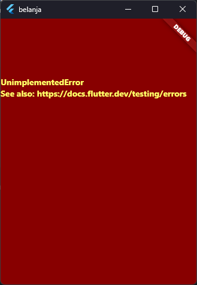
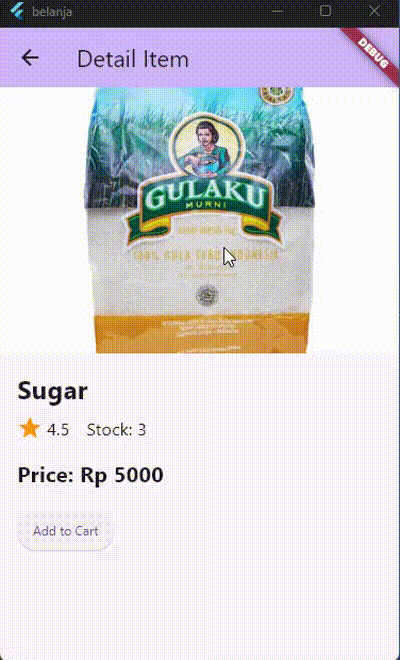

## Praktikum Pemrograman Mobile

> Nama : Aji Hamdani Ahmad <br />
> NIM: 2241720155 <br />
> Kelas : TI-3G <br />
> Absen : 04 <br />

### Praktikum 1: Membangun Layout di Flutter

- Membuat project baru flutter dengan nama `layout_flutter`
- Edit kode pada `main.dart`. Isi dengan Nama dan NIM di text title

  ```dart
  Widget build(BuildContext context) {
  return MaterialApp(
    title: 'Flutter layout: Aji Hamdani Ahmad | 2241720155',
    home: Scaffold(
      appBar: AppBar(
        title: const Text('Flutter layout demo'),
      ),
      body: const Center(
        child: Text('Hello World'),
      ),
    ),
  );
  }
  ```

- Mengimplementasi Title Row

  Pertama, Anda akan membuat kolom bagian kiri pada judul. Tambahkan kode berikut di bagian atas metode build() di dalam kelas `MyApp`:

  Terdapat beberapa pertanyaan yang harus diisi sesuai dengan instruksi berikut

  **Soal 1** Letakkan widget Column di dalam widget Expanded agar menyesuaikan ruang yang tersisa di dalam widget Row. Tambahkan properti crossAxisAlignment ke CrossAxisAlignment.start sehingga posisi kolom berada di awal baris.

  **Soal 2** Letakkan baris pertama teks di dalam Container sehingga memungkinkan Anda untuk menambahkan padding = 8. Teks ‘Batu, Malang, Indonesia' di dalam Column, set warna menjadi abu-abu.

  **Soal 3** Dua item terakhir di baris judul adalah ikon bintang, set dengan warna merah, dan teks "41". Seluruh baris ada di dalam Container dan beri padding di sepanjang setiap tepinya sebesar 32 piksel. Kemudian ganti isi body text ‘Hello World' dengan variabel titleSection seperti berikut:

  ```dart
    @override
    Widget build(BuildContext context) {
        Widget titleSection = Container(
            padding: const EdgeInsets.all(32),
            child: Row(
                children: [
                Expanded(
                    // soal 1
                    child: Column(
                    crossAxisAlignment: CrossAxisAlignment.start,
                    children: [
                        // soal 2
                        Container(
                        padding: const EdgeInsets.only(bottom: 8),
                        child: const Text(
                            'Wisata Gunung di Batu',
                            style: TextStyle(
                            fontWeight: FontWeight.bold,
                            ),
                        ),
                        ),
                        const Text(
                        'Batu, Malang, Indonesia',
                        style: TextStyle(color: Colors.grey),
                        ),
                    ],
                    ),
                ),
                // soal 3
                const Icon(
                    Icons.star,
                    color: Colors.red,
                ),
                const Text('41'),
                ],
            ),
        );

        return MaterialApp(
            title: 'Flutter layout: Aji Hamdani Ahmad | 2241720155',
            home: Scaffold(
                appBar: AppBar(
                    title: const Text('Flutter layout demo'),
                ),
                body: Column(
                    children: [titleSection],
                ),
            ),
        );
    }
  ```

  Dengan implementasi kode tersebut maka akan menghasilkan output sebagai berikut:

  

### Praktikum 2: Implementasi Button Row

- Membuat fungsi `_buildButtonColumn` pada class `MyApp`

  ```dart
  Column _buildButtonColumn(Color color, IconData icon, String label) {
    return Column(
        mainAxisSize: MainAxisSize.min,
        mainAxisAlignment: MainAxisAlignment.center,
        children: [
        Icon(
            icon,
            color: color,
        ),
        Container(
            margin: const EdgeInsets.only(top: 8),
            child: Text(
            label,
            style: TextStyle(
                fontSize: 12, fontWeight: FontWeight.w400, color: color),
            ),
        )
        ],
    );
  }
  ```

- Membuat widget `buttonSection` dibawah dari `titleSection`

  ```dart
  @override
  Widget build(BuildContext context) {
    Widget titleSection = Container(
        // Title Section Content
    );

    Color color = Theme.of(context).primaryColor;

    Widget buttonSection = Row(
        mainAxisAlignment: MainAxisAlignment.spaceEvenly,
        children: [
            _buildButtonColumn(color, Icons.call, 'CALL'),
            _buildButtonColumn(color, Icons.near_me, 'ROUTE'),
            _buildButtonColumn(color, Icons.share, 'SHARE'),
        ],
    );
  }
  ```

- Menambahkan button section ke body

  ```dart
  @override
  Widget build(BuildContext context) {
      Widget titleSection = Container(
        // titleSection Content
      );

      Color color = Theme.of(context).primaryColor;

      Widget buttonSection = Row(
        // buttonSection Content
      );

      return MaterialApp(
        title: 'Flutter layout: Aji Hamdani Ahmad | 2241720155',
        home: Scaffold(
            appBar: AppBar(
                title: const Text('Flutter layout demo'),
                ),
                body: Column(
                children: [titleSection, buttonSection],
                ),
            ),
        );
    }
  ```

  Dengan implementasi kode tersebut maka output yang dihasilkan akan seperti berikut:

  

### Praktikum 3: Implementasi Text Section

- Membuat widget `textSection`

  Tentukan bagian teks sebagai variabel. Masukkan teks ke dalam Container dan tambahkan padding di sepanjang setiap tepinya. Tambahkan kode berikut tepat di bawah deklarasi buttonSection:

  ```dart
  Widget textSection = Container(
    padding: const EdgeInsets.all(32),
    child: const Text(
    'Jelajahi keindahan alam yang tersembunyi '
    'dan rasakan sensasi berenang di kolam alami yang jernih. '
    'Pengalaman yang tak terlupakan menantimu di sini. '
    'Saya Aji Hamdani Ahmad dengan NIM 2241720155.'
    'Ini hasil pekerjaan saya 🙂.',
    softWrap: true,
    ),
  );
  ```

  Memberikan `softWrap` akan membuat text memenuhi sesuai lebar kolom sebelum membungkusnya pada batas kata.

- Menambahkan `textSection` pada body

  ```dart
  return MaterialApp(
    title: 'Flutter layout: Aji Hamdani Ahmad | 2241720155',
    home: Scaffold(
        appBar: AppBar(
            title: const Text('Flutter layout demo'),
        ),
        body: Column(
            children: [titleSection, buttonSection, textSection],
        ),
    ),
  );
  ```

  Dengan implementasi kode tersebut maka output yang dihasilkan akan seperti berikut:

  

### Praktikum 4: Implementasi Image Section

- Menyiapkan aset gambar

  Anda dapat mencari gambar di internet yang ingin ditampilkan. Buatlah folder images di root project layout_flutter. Masukkan file gambar tersebut ke folder images, lalu set nama file tersebut ke file pubspec.yaml seperti berikut:

  Gambar yang akan digunakan:

  

  Configurasi `pubspec.yaml`

  

- Menambahkan gambar ke body

  ```dart
  return MaterialApp(
    title: 'Flutter layout: Aji Hamdani Ahmad | 2241720155',
    home: Scaffold(
      appBar: AppBar(
        title: const Text('Flutter layout demo'),
      ),
      body: Column(
        children: [
          Image.asset(
            'images/wisata-malang.jpg',
            width: 600,
            height: 240,
            fit: BoxFit.cover,
          ),
          buttonSection,
          textSection
        ],
      ),
    ),
  );
  ```

  Setelah menambahkan gambar ke body maka kan menampilkan output seperti berikut:

  

- Mengubah menjadi `ListView`

  ```dart
   return MaterialApp(
    title: 'Flutter layout: Aji Hamdani Ahmad | 2241720155',
    home: Scaffold(
        appBar: AppBar(
        title: const Text('Flutter layout demo'),
        ),
        body: ListView(
        children: [
            Image.asset(
            'images/wisata-malang.jpg',
            width: 600,
            height: 240,
            fit: BoxFit.cover,
            ),
            buttonSection,
            textSection
        ],
        ),
    ),
  );
  ```

  Ketika menggunakan `ListView` maka ketika terjadi overflow karena resolusi yang terlalu kecil akan dapat menambahkan scroll untuk mengatasinya

  

  Namun jika tidak menggunakan `ListView` atau tetap menggunakan `Column` yang sebelumnya, Maka ketika terjadi overflow pada resolusi yang kecil akan memunculkan warning seperti berikut :

  

### Praktikum 5: Membangun Navigasi di Flutter

- Menyiapkan project baru

  

- Mendefinisikan route

  Buatlah dua buah file dart dengan nama home_page.dart dan item_page.dart pada folder pages. Untuk masing-masing file, deklarasikan class HomePage pada file home_page.dart dan ItemPage pada item_page.dart. Turunkan class dari StatelessWidget. Gambaran potongan kode dapat anda lihat sebagai berikut.

  `home_page.dart`

  ```dart
  class HomePage extends StatelessWidget {
    const HomePage({super.key});

    @override
    Widget build(BuildContext context) {
      throw UnimplementedError();
    }
  }
  ```

  `item_page.dart`

  ```dart
  class ItemPage extends StatelessWidget {
    const ItemPage({super.key});

    @override
    Widget build(BuildContext context) {
      throw UnimplementedError();
    }
  }
  ```

- Lengkapi kode di `main.dart`

  Setelah kedua halaman telah dibuat dan didefinisikan, bukalah file main.dart. Pada langkah ini anda akan mendefinisikan Route untuk kedua halaman tersebut. Definisi penamaan route harus bersifat unique. Halaman HomePage didefinisikan sebagai /. Dan halaman ItemPage didefinisikan sebagai /item. Untuk mendefinisikan halaman awal, anda dapat menggunakan named argument initialRoute.

  ```dart
  void main() {
    runApp(MaterialApp(
      initialRoute: '/',
      routes: {
        '/': (context) => HomePage(),
        '/item': (context) => ItemPage()
      },
    ));
  }
  ```

- Membuat data model

  Sebelum melakukan perpindahan halaman dari HomePage ke ItemPage, dibutuhkan proses pemodelan data. Pada desain mockup, dibutuhkan dua informasi yaitu nama dan harga. Untuk menangani hal ini, buatlah sebuah file dengan nama item.dart dan letakkan pada folder models. Pada file ini didefinisikan pemodelan data yang dibutuhkan.

  ```dart
  class Item {
    String name;
    int price;

    Item({required this.name, required this.price});
  }
  ```

  Pada constructor membutuhkan keyword required untuk membuat attribute wajib diisi, karena jika tidak terdapat error dari dart mengenai non-nullable attribute

- Lengkapi kode di class HomePage

  Pada halaman HomePage terdapat ListView widget. Sumber data ListView diambil dari model List dari object Item. Gambaran kode yang dibutuhkan untuk melakukan definisi model dapat anda lihat sebagai berikut.

  ```dart
  class HomePage extends StatelessWidget {
    final List<Item> items = [
      Item(name: 'Sugar', price: 5000),
      Item(name: 'Salt', price: 2000)
    ];

    @override
    Widget build(BuildContext context) {
      throw UnimplementedError();
    }
  }
  ```

- Membuat ListView dan itemBuilder

  Untuk menampilkan ListView pada praktikum ini digunakan itemBuilder. Data diambil dari definisi model yang telah dibuat sebelumnya. Untuk menunjukkan batas data satu dan berikutnya digunakan widget Card. Kode yang telah umum pada bagian ini tidak ditampilkan.

  ```dart
  class HomePage extends StatelessWidget {
    final List<Item> items = [
      Item(name: 'Sugar', price: 5000),
      Item(name: 'Salt', price: 2000)
    ];

    @override
    Widget build(BuildContext context) {
      return Scaffold(
        body: Container(
          margin: const EdgeInsets.all(8),
          child: ListView.builder(
              itemCount: items.length,
              itemBuilder: (context, index) {
                final item = items[index];
                return Card(
                  child: Container(
                    margin: const EdgeInsets.all(8),
                    child: Row(
                      children: [
                        Expanded(child: Text(item.name)),
                        Expanded(
                            child: Text(
                          item.price.toString(),
                          textAlign: TextAlign.end,
                        ))
                      ],
                    ),
                  ),
                );
              }),
        ),
      );
    }
  }
  ```

  Dengan kode tersebut maka akan dapat menampilkan output seperti berikut berupa data list Item.

  

- Menambahkan aksi pada ListView

  Item pada ListView saat ini ketika ditekan masih belum memberikan aksi tertentu. Untuk menambahkan aksi pada ListView dapat digunakan widget InkWell atau GestureDetector. Perbedaan utamanya InkWell merupakan material widget yang memberikan efek ketika ditekan. Sedangkan GestureDetector bersifat umum dan bisa juga digunakan untuk gesture lain selain sentuhan. Pada praktikum ini akan digunakan widget InkWell.

  Untuk menambahkan sentuhan, letakkan cursor pada widget pembuka Card. Kemudian gunakan shortcut quick fix dari VSCode (Ctrl + . pada Windows atau Cmd + . pada MacOS). Sorot menu wrap with widget... Ubah nilai widget menjadi InkWell serta tambahkan named argument onTap yang berisi fungsi untuk berpindah ke halaman ItemPage. Ilustrasi potongan kode dapat anda lihat pada potongan berikut.

  ```dart
  @override
  Widget build(BuildContext context) {
    return Scaffold(
      appBar: AppBar(
        title: const Text('Shopping List'),
        backgroundColor: Theme.of(context).colorScheme.inversePrimary,
      ),
      body: Container(
        margin: const EdgeInsets.all(8),
        child: ListView.builder(
            itemCount: items.length,
            itemBuilder: (context, index) {
              final item = items[index];
              return InkWell(
                onTap: () {
                  Navigator.pushNamed(context, '/item');
                },
                child: Card(
                  child: Container(
                    margin: const EdgeInsets.all(8),
                    child: Row(
                      children: [
                        Expanded(child: Text(item.name)),
                        Expanded(
                            child: Text(
                          item.price.toString(),
                          textAlign: TextAlign.end,
                        ))
                      ],
                    ),
                  ),
                ),
              );
            }),
      ),
    );
  }
  ```

  Dengan penambahan aksi pada ListView, maka ketika salah satu item di-tap, maka akan menavigasi ke route `/item`. Namun masih terdapat exception `UnimplementedError` karena belum diimplementasi.

  

### Tugas Praktikum 2

1. Untuk melakukan pengiriman data ke halaman berikutnya, cukup menambahkan informasi arguments pada penggunaan `Navigator`. Perbarui kode pada bagian `Navigator` menjadi seperti berikut.

   ```dart
   onTap: () {
     Navigator.pushNamed(context, '/item', arguments: item);
   }
   ```

2. Pembacaan nilai yang dikirimkan pada halaman sebelumnya dapat dilakukan menggunakan ModalRoute. Tambahkan kode berikut pada blok fungsi build dalam halaman ItemPage. Setelah nilai didapatkan, anda dapat menggunakannya seperti penggunaan variabel pada umumnya. [Navigate with arguments](https://docs.flutter.dev/cookbook/navigation/navigate-with-arguments)

   ```dart
   class ItemPage extends StatelessWidget {
     const ItemPage({super.key});

     @override
     Widget build(BuildContext context) {
       final itemArgs = ModalRoute.of(context)!.settings.arguments as Item;

       return Scaffold(
         appBar: AppBar(
           title: const Text('Detail Item'),
           backgroundColor: Theme.of(context).colorScheme.inversePrimary,
         ),
         body: Column(
           children: [
             Text("Nama: ${itemArgs.name}"),
             Text("Harga: ${itemArgs.price.toString()}")
           ],
         ),
       );
     }
   }
   ```

   Dengan implementasi kode tersebut maka ketika list item di-tap, maka akan mengarahkan ke `ItemPage` dengan data item menjadi argument-nya.

   

3. Pada hasil akhir dari aplikasi belanja yang telah anda selesaikan, tambahkan atribut foto produk, stok, dan rating. Ubahlah tampilan menjadi GridView seperti di aplikasi marketplace pada umumnya.

- Menambahkan beberapa attribute baru pada model `Item`

  ```dart
  class Item {
    String name;
    String imagePath;
    int stock;
    double rate;
    int price;

    Item(
        {required this.name,
        required this.imagePath,
        required this.stock,
        required this.rate,
        required this.price});
  }
  ```

- Memodifikasi argument pada list item dan juga component yang diterapkan pada widget HomePage

  ```dart
  class HomePage extends StatelessWidget {
    final List<Item> items = [
      Item(
          name: 'Sugar',
          imagePath: 'assets/images/products/gula.jpeg',
          stock: 3,
          rate: 4.5,
          price: 5000),
      Item(
          name: 'Salt',
          imagePath: 'assets/images/products/garam.jpg',
          stock: 10,
          rate: 5,
          price: 2000),
    ];

    @override
    Widget build(BuildContext context) {
      return Scaffold(
        appBar: AppBar(
          title: const Text('Shopping List'),
          backgroundColor: Theme.of(context).colorScheme.inversePrimary,
        ),
        body: Container(
          margin: const EdgeInsets.all(8),
          child: GridView.builder(
            itemCount: items.length,
            gridDelegate: const SliverGridDelegateWithFixedCrossAxisCount(
              crossAxisCount: 2,
              crossAxisSpacing: 8,
              mainAxisSpacing: 8,
              childAspectRatio: 0.65,
            ),
            itemBuilder: (context, index) {
              final item = items[index];
              return InkWell(
                onTap: () {
                  Navigator.pushNamed(context, '/item', arguments: item);
                },
                child: Card(
                  elevation: 4,
                  shape: RoundedRectangleBorder(
                    borderRadius: BorderRadius.circular(10),
                  ),
                  child: Column(
                    crossAxisAlignment: CrossAxisAlignment.start,
                    children: [
                      AspectRatio(
                        aspectRatio: 1.0,
                        child: Image.asset(
                          item.imagePath,
                          width: double.infinity,
                          fit: BoxFit.cover,
                        ),
                      ),
                      Expanded(
                        child: Padding(
                          padding: const EdgeInsets.all(8.0),
                          child: Column(
                            crossAxisAlignment: CrossAxisAlignment.start,
                            mainAxisAlignment: MainAxisAlignment.start,
                            children: [
                              Row(
                                mainAxisAlignment: MainAxisAlignment.spaceBetween,
                                children: [
                                  Text(
                                    item.name,
                                    style: const TextStyle(
                                      fontWeight: FontWeight.bold,
                                      fontSize: 16,
                                    ),
                                  ),
                                  Row(
                                    children: [
                                      const Icon(
                                        Icons.star,
                                        color: Colors.orange,
                                        size: 16,
                                      ),
                                      const SizedBox(
                                        width: 4,
                                      ),
                                      Text(
                                        item.rate.toString(),
                                        style: const TextStyle(
                                            fontWeight: FontWeight.w400),
                                      )
                                    ],
                                  )
                                ],
                              ),
                              const SizedBox(height: 5),
                              Text(
                                'Rp ${item.price}',
                                style: const TextStyle(fontSize: 14),
                              ),
                              const SizedBox(
                                height: 5,
                              ),
                              Row(
                                children: [
                                  const Text('Stock: '),
                                  Text(
                                    item.stock.toString(),
                                    style: const TextStyle(
                                        fontWeight: FontWeight.bold),
                                  )
                                ],
                              )
                            ],
                          ),
                        ),
                      ),
                    ],
                  ),
                ),
              );
            },
          ),
        ),
      );
    }
  }
  ```

  Dengan implementasi component tersebut, output yang dihasilkan akan seperti berikut:

  

  Menggunakan GridView dapat membantu dalam membuat sebuah layout grid dimana memungkinkan untuk menampilkan item dalam baris dan kolom sesuai dengan yang kita tentukan. Kemudian dapat memanfaatkan `Navigator` untuk melakukan navigasi ke halaman atau page detail ketika menekan product tertentu. Untuk menampilkan detail product terdapat page baru yaitu `ItemPage`.

  ```dart
  class ItemPage extends StatelessWidget {
    const ItemPage({super.key});

    @override
    Widget build(BuildContext context) {
      final product = ModalRoute.of(context)!.settings.arguments as Item;

      return Scaffold(
        appBar: AppBar(
          title: const Text('Detail Item'),
          backgroundColor: Theme.of(context).colorScheme.inversePrimary,
        ),
        body: ListView(
          children: [
            Image.asset(
              product.imagePath,
              fit: BoxFit.cover,
              height: 250,
              width: double.infinity,
            ),
            Padding(
              padding: const EdgeInsets.all(16.0),
              child: Column(
                crossAxisAlignment: CrossAxisAlignment.start,
                children: [
                  Text(
                    product.name,
                    style: const TextStyle(
                        fontSize: 24, fontWeight: FontWeight.bold),
                  ),
                  const SizedBox(height: 8),
                  Row(
                    children: [
                      const Icon(
                        Icons.star,
                        color: Colors.orange,
                      ),
                      const SizedBox(width: 4),
                      Text(
                        product.rate.toString(),
                        style: const TextStyle(fontSize: 16),
                      ),
                      const SizedBox(width: 16),
                      Text(
                        'Stock: ${product.stock}',
                        style: const TextStyle(fontSize: 16),
                      ),
                    ],
                  ),
                  const SizedBox(height: 16),
                  Text(
                    'Price: Rp ${product.price}',
                    style: const TextStyle(
                        fontSize: 20, fontWeight: FontWeight.bold),
                  ),
                  const SizedBox(height: 20),
                  ElevatedButton(
                    style: ElevatedButton.styleFrom(
                      padding: const EdgeInsets.symmetric(vertical: 16),
                      textStyle: const TextStyle(fontSize: 18),
                    ),
                    child: const Padding(
                        padding:
                            EdgeInsets.symmetric(horizontal: 15, vertical: 3),
                        child: Text(
                          'Add to Cart',
                          style: TextStyle(fontSize: 12),
                        )),
                  ),
                ],
              ),
            ),
          ],
        ),
      );
    }
  }
  ```

  Dengan widget `ItemPage` diatas ketika melakukan klik pada salah satu product akan menampilkan halaman berikut:

  

  Data yang ditampilkan didapatkan dari parameter yang dikirimkan melalui argument saat melakukan navigasi. Argument tersebut diterima oleh widget `ItemPage`

4. Silakan implementasikan Hero widget pada aplikasi belanja Anda dengan mempelajari dari sumber ini: [Hero Animation Flutter](https://docs.flutter.dev/cookbook/navigation/hero-animations)

   Menerapkan hero animation pada image `ItemPage`

   ```dart
   class ItemPage extends StatelessWidget {
    const ItemPage({super.key});

    @override
    Widget build(BuildContext context) {
      final product = ModalRoute.of(context)!.settings.arguments as Item;

      return Scaffold(
        appBar: AppBar(
          title: const Text('Detail Item'),
          backgroundColor: Theme.of(context).colorScheme.inversePrimary,
        ),
        body: ListView(
          children: [
            GestureDetector(
              onTap: () {
                Navigator.push(
                  context,
                  MaterialPageRoute(
                    builder: (context) => DetailImage(product: product),
                  ),
                );
              },
              child: Hero(
                tag: "${product.name} Hero",
                child: Image.asset(
                  product.imagePath,
                  fit: BoxFit.cover,
                  height: 250,
                  width: double.infinity,
                ),
              ),
            ),
            // Code hidden
          ],
        ),
      );
    }
   }

   class DetailImage extends StatelessWidget {
    final Item product;

    const DetailImage({super.key, required this.product});

    @override
    Widget build(BuildContext context) {
      return Scaffold(
        body: GestureDetector(
          onTap: () {
            Navigator.pop(context);
          },
          child: Container(
            constraints: const BoxConstraints
                .expand(),
            child: Hero(
              tag: product.name,
              child: Image.asset(
                product.imagePath,
                fit: BoxFit.cover,
              ),
            ),
          ),
        ),
      );
    }
   }
   ```

   Dengan implementasi hero animation akan menambahkan animasi pada saat melakukan navigasi antar-page.

   

5. Sesuaikan dan modifikasi tampilan sehingga menjadi aplikasi yang menarik. Selain itu, pecah widget menjadi kode yang lebih kecil. Tambahkan Nama dan NIM di footer aplikasi belanja Anda.

   Saya rasa untuk aplikasi sudah lumayan menarik sehingga tidak perlu lagi memodifikasi tampilan lebih jauh 😊, Namun mungkin terdapat beberapa part yang dapat dilakukan pemecahan sehingga bisa lebih modular.

   - Memisahkan card component menjadi widget tersendiri

     path file: `components/product_card.dart`

     ```dart
     class ProductCard extends StatelessWidget {
       final Item product;

       const ProductCard({super.key, required this.product});

       @override
       Widget build(BuildContext context) {
         return Card(
           elevation: 4,
           shape: RoundedRectangleBorder(
             borderRadius: BorderRadius.circular(10),
           ),
           child: Column(
             crossAxisAlignment: CrossAxisAlignment.start,
             children: [
               AspectRatio(
                 aspectRatio: 1.0,
                 child: Image.asset(
                   product.imagePath,
                   width: double.infinity,
                   fit: BoxFit.cover,
                 ),
               ),
               Expanded(
                 child: Padding(
                   padding: const EdgeInsets.all(8.0),
                   child: Column(
                     crossAxisAlignment: CrossAxisAlignment.start,
                     mainAxisAlignment: MainAxisAlignment.start,
                     children: [
                       Row(
                         mainAxisAlignment: MainAxisAlignment.spaceBetween,
                         children: [
                           Text(
                             product.name,
                             style: const TextStyle(
                               fontWeight: FontWeight.bold,
                               fontSize: 16,
                             ),
                           ),
                           Row(
                             children: [
                               const Icon(
                                 Icons.star,
                                 color: Colors.orange,
                                 size: 16,
                               ),
                               const SizedBox(
                                 width: 4,
                               ),
                               Text(
                                 product.rate.toString(),
                                 style: const TextStyle(fontWeight: FontWeight.w400),
                               )
                             ],
                           )
                         ],
                       ),
                       const SizedBox(height: 5),
                       Text(
                         'Rp ${product.price}',
                         style: const TextStyle(fontSize: 14),
                       ),
                       const SizedBox(
                         height: 5,
                       ),
                       Row(
                         children: [
                           const Text('Stock: '),
                           Text(
                             product.stock.toString(),
                             style: const TextStyle(fontWeight: FontWeight.bold),
                           )
                         ],
                       )
                     ],
                   ),
                 ),
               ),
             ],
           ),
         );
       }
     }
     ```

   - Memisahkan list data yang digunakan untuk menampung `Item` pada tempat tersendiri untuk merepresentasikan data yang dimiliki.

     path file: `datas/products.dart`

     ```dart
     List<Item> items = [
      Item(
          name: 'Sugar',
          imagePath: 'assets/images/products/gula.jpeg',
          stock: 3,
          rate: 4.5,
          price: 5000),
      Item(
          name: 'Salt',
          imagePath: 'assets/images/products/garam.jpg',
          stock: 10,
          rate: 5,
          price: 2000),
     ];
     ```

   - Dengan memisahkan beberapa component tersebut, kini HomePage hanya perlu memanggil component yang singkat saja.

     path file: `pages/home_page.dart`

     ```dart
     class HomePage extends StatelessWidget {
       @override
       Widget build(BuildContext context) {
         return Scaffold(
           appBar: AppBar(
             title: const Text('Shopping List'),
             backgroundColor: Theme.of(context).colorScheme.inversePrimary,
           ),
           body: Container(
             margin: const EdgeInsets.all(8),
             child: GridView.builder(
               itemCount: items.length,
               gridDelegate: const SliverGridDelegateWithFixedCrossAxisCount(
                 crossAxisCount: 2,
                 crossAxisSpacing: 8,
                 mainAxisSpacing: 8,
                 childAspectRatio: 0.65,
               ),
               itemBuilder: (context, index) {
                 final item = items[index];
                 return InkWell(
                     onTap: () {
                       Navigator.pushNamed(context, '/item', arguments: item);
                     },
                     child: ProductCard(product: item));
               },
             ),
           ),
         );
       }
     }
     ```

     Untuk menambahkan footer dapat membuat widget baru yang digunakan menyimpan component footer

     path file: `components/footer.dart`

     ```dart
     class Footer extends StatelessWidget {
      const Footer({super.key});

      @override
      Widget build(BuildContext context) {
        return Container(
          width: double.infinity,
          padding: const EdgeInsets.all(16.0),
          color: Theme.of(context).colorScheme.inversePrimary,
          child: const Column(
            children: [
              Text(
                'Nama: Aji Hamdani Ahmad',
                style: TextStyle(color: Colors.black, fontSize: 18),
              ),
              Text(
                'NIM: 2241720155',
                style: TextStyle(color: Colors.black, fontSize: 18),
              )
            ],
          ),
        );
      }
     }
     ```

     Dengan widget tersebut pada HomePage hanya tinggal memanggil dan dapat menerapkan footer sehingga output-nya akan seperti berikut:

     

6. Selesaikan Praktikum 5: Navigasi dan Rute tersebut. Cobalah modifikasi menggunakan plugin go_router, lalu dokumentasikan dan push ke repository Anda berupa screenshot setiap hasil pekerjaan beserta penjelasannya di file README.md. Kumpulkan link commit repository GitHub Anda kepada dosen yang telah disepakati!

   - Install `go_router` package

     

   - Menerapkan pada routing table

     ```dart
     // ------- ROUTING IMPLEMENTATION WITH GO ROUTER ------- //

     final GoRouter _router = GoRouter(routes: <RouteBase>[
       GoRoute(
           path: '/',
           builder: (BuildContext context, GoRouterState state) {
             return HomePage();
           }),
       GoRoute(
           path: '/item',
           builder: (BuildContext context, GoRouterState state) {
             final Item item = state.extra! as Item;
             return ItemPage(product: item);
           })
     ]);

     void main() {
       runApp(MaterialApp.router(
         routerConfig: _router,
       ));
     }
     ```

   - Merubah implementasi navigasi yang dilakukan pada `HomePage` ketika item di-tap atau click menjadi seperti berikut :

     ```dart
     GoRouter.of(context).push('/item', extra: item);
     ```

     Serta implementasi melakukan pop navigation stack bisa dilakukan hanya dengan melalui context dengan kode seperti berikut:

     ```dart
     context.pop();
     ```

     Namun untuk mengimplementasikan cara tersebut perlu untuk melakukan import pada package go_router terlebih dahulu.

     Setelah itu aplikasi akan dapat berjalan seperti sebelumnya namun dengan menggunakan implementasi plugin `go_router`.

     Berikut adalah hasil dari aplikasi setelah menggunakan `go_router`:

     
