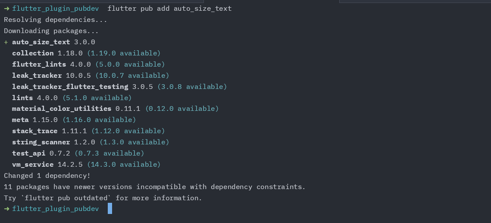
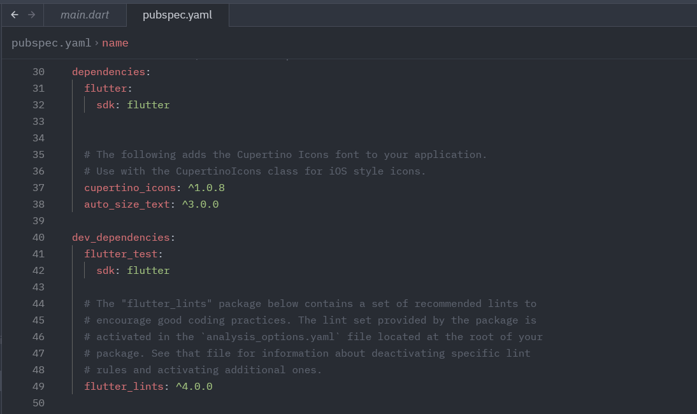
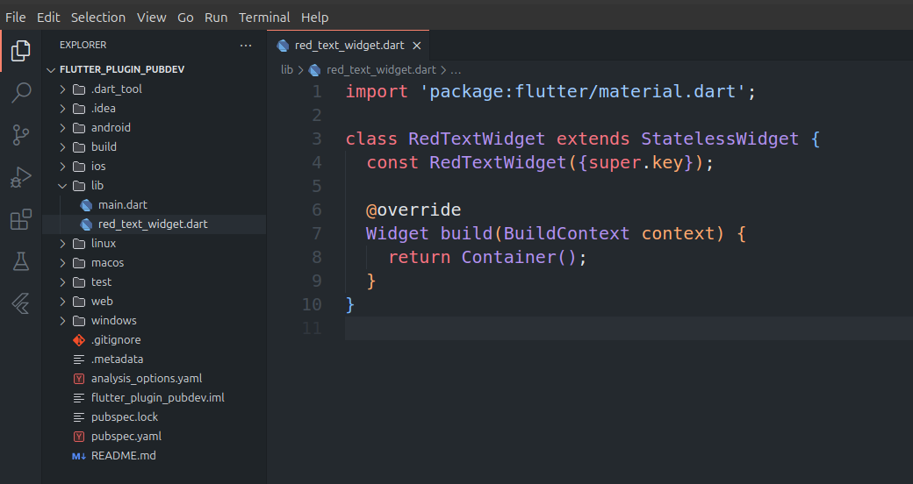
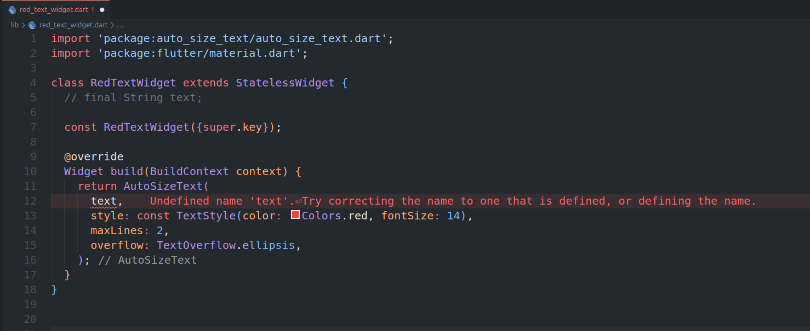
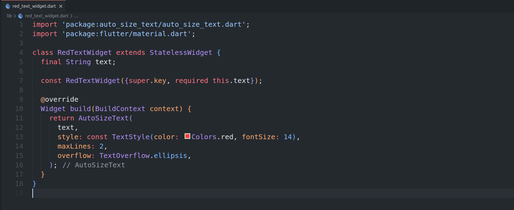
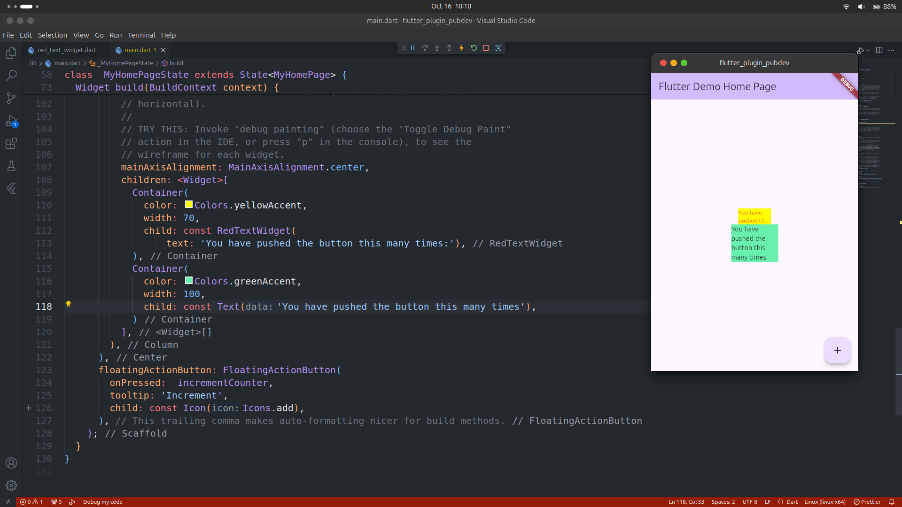

## Praktikum Pemrograman Mobile

> Nama : Aji Hamdani Ahmad <br />
> NIM: 2241720155 <br />
> Kelas : TI-3G <br />
> Absen : 04 <br />

### Praktikum Menerapkan Plugin di Project Flutter

- Langkah 1: Buat Project Baru
- Langkah 2: Menambahkan Plugin
  Tambahkan plugin `auto_size_text` dengan menggunakan perintah berikut di terminal

  

  Jika berhasil maka akan tampil nama plugin beserta versinya pada pubspec.yaml pada bagian dependencies

  

- Langkah 3: Buat File read_text_widget.dart
  

- Langkah 4: Tambah Widget Auto Size

  

- Langkah 5: Buat variable text dan parameter di Constructor
  

- Langkah 6: Tambahkan widget di main.dart
  

### Tugas Praktikum

1. Selesaikan Praktikum tersebut, lalu dokumentasikan dan push ke repository Anda berupa screenshot hasil pekerjaan beserta penjelasannya di file README.md!
2. Jelaskan maksud dari langkah 2 pada praktikum tersebut!

   Pada langkah 2 merupakan proses menambahkan plugin pada dependency project Flutter.
   langkah tersebut dapat dilakukan dengan menggunakan perintah dari flutter yaitu

   ```bash
   flutter pub add <plugin_name>
   ```

   Seperti yang dilakukan pada praktikum langkah 2 sebelumnya yaitu menambahkan plugin `auto_size_text` sehingga
   perintah menjadi seperti berikut

   ```bash
   flutter pub add auto_size_text
   ```

   Ketika perintah tersebut dijalankan, maka flutter akan menambahkan dependency pada `pubspec.yaml`

   

3. Jelaskan maksud dari langkah 5 pada praktikum tersebut!

   Pada langkah 5 bertujuan untuk mendefinisikan attribute baru yaitu text,
   Kemudian menjadikan nya sebagai parameter yang wajib diisi pada constructor widget `RedTextWidget`

4. Pada langkah 6 terdapat dua widget yang ditambahkan, jelaskan fungsi dan perbedaannya!

   Pada langkah 6 menambahkan dua widget yaitu `Container` yang di dalamnya terdapat widget `Text` dan juga `RedTextWidget` dimana pada `RedTextWidget` tersusun dari `AutoSizeText` dimana keduanya memiliki perbedaan yaitu ketika menggunakan AutoSizeText memungkinkan text secara otomatis menyesuaikan ukurannya agar pas dalam ruang yang tersedia. Sedangkan untuk `Text` biasa tidak dapat menyesuaikan ukurannya terhadap widget pembungkusnya.

5. Jelaskan maksud dari tiap parameter yang ada di dalam plugin auto_size_text berdasarkan tautan pada dokumentasi [ini](https://pub.dev/documentation/auto_size_text/latest/)!

   Berdasarkan dokumentasi tersebut, terdapat beberapa parameter yang dapat digunakan pada widget `AutoSizeText` yaitu:

   | Parameters          | Penjelasan                                                                                                                                                     |
   | ------------------- | -------------------------------------------------------------------------------------------------------------------------------------------------------------- |
   | text                | Text yang berisikan konten utama yang ingin ditampilkan pada widget                                                                                            |
   | style               | Digunakan untuk mengatur style dari widget seperti warna, ukuran, ketebalan dan dan lain-lain. Penggunaan parameter style ini juga sama seperti di widget Text |
   | maxLines            | Parameter yang digunakan untuk membatasi jumlah maksimal baris yang akan ditampilkan                                                                           |
   | minFontSize         | Menetapkan ukuran minimum yang dapat diterapkan untuk text                                                                                                     |
   | maxFontSize         | Menetapkan ukuran maximum yang dapat diterapkan pada text                                                                                                      |
   | presentFontSizes    | Mengatur ukuran font yang diterapkan, membantu untuk menyesuaikan teks agar menyesuaikan dengan ruang yang tersedia                                            |
   | overflow            | Parameter yang menerima sebuah fungsi untuk mengatasi ketika terjadi overflow pada text                                                                        |
   | overflowReplacement | Menjadi salah satu alternatif untuk menampilkan sebuah widget ketika text tidak muat pada ruang yang tersedia                                                  |
   | wrapWords           | Mengatur apakah teks dibungkus di akhir kata                                                                                                                   |
   | textAlign           | Mengatur bagaimana text diluruskan secara horizontal                                                                                                           |
   | textDirection       | Mengatur arah text ditampilkan, value yang diberikan yaitu dari TextAlign yang akan direpresentasikan oleh `textDirection`                                     |
   | softWrap            | Mengatur apakah teks terputus ke baris baru saat tidak muat. Jika aktif, teks akan melanjutkan otomatis ke baris berikutnya.                                   |
